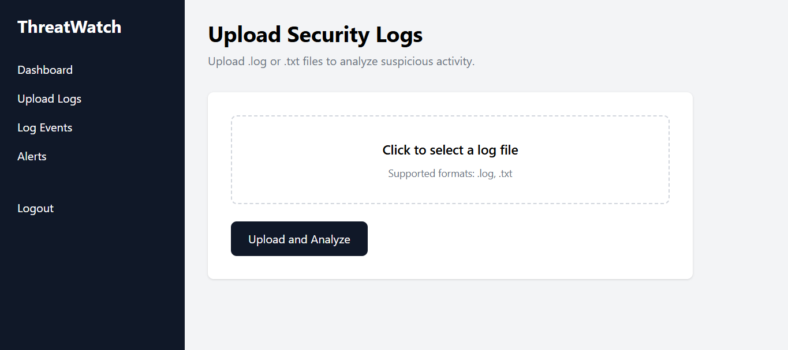
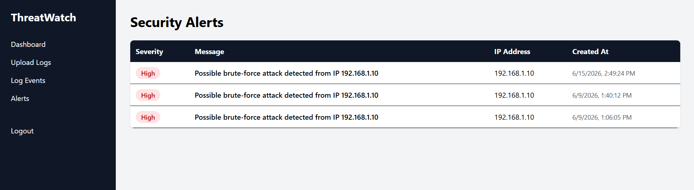
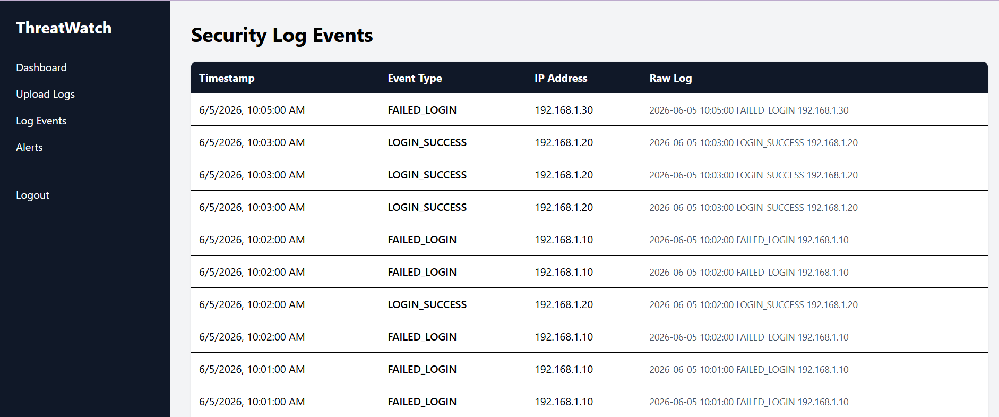
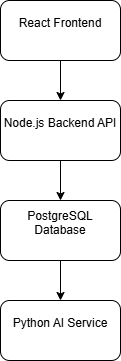

# AI-Powered Security Dashboard

A full-stack cybersecurity platform that ingests security logs, detects suspicious activity, generates alerts, visualizes security metrics, and provides AI-powered security analysis using a local Large Language Model (Ollama + Llama 3.2).

---

## Overview

Security teams analyze large volumes of authentication and system logs to identify potential threats.

This project simulates a lightweight Security Information and Event Management (SIEM) platform by:

* Uploading and processing security log files
* Detecting suspicious activity
* Generating security alerts
* Calculating risk scores
* Visualizing security metrics
* Providing AI-generated security insights

---

## Features

### Authentication & Security

* User Registration
* User Login
* JWT Authentication
* Protected Routes
* Session Management

### Log Management

* Upload `.log` and `.txt` files
* Automatic log parsing
* Event extraction
* Event storage in PostgreSQL

### Threat Detection

* Failed Login Detection
* Brute Force Attack Detection
* Suspicious IP Monitoring
* Security Alert Generation
* Alert Severity Classification

### Security Analytics

* Total Events Dashboard
* Total Alerts Dashboard
* High Severity Alerts
* Failed Login Monitoring
* Risk Score Calculation
* Top Attacking IPs
* Event Timeline Analysis
* Security Recommendations

### AI Security Analyst

* Local AI integration using Ollama
* Llama 3.2 powered analysis
* AI-generated security summaries
* Automated security recommendations
* Natural language threat analysis

---

## Screenshots

### Dashboard


### Upload Logs



### Alerts



### Log Events



---

## Technology Stack

### Frontend

* React
* TypeScript
* Vite
* Tailwind CSS
* Axios
* React Router
* Recharts

### Backend

* Node.js
* Express.js
* JWT Authentication
* Multer
* bcrypt

### Database

* PostgreSQL

### AI Integration

* Ollama
* Llama 3.2
* Local LLM Inference

### Development Tools

* Git
* GitHub
* VS Code
* Postman
* pgAdmin

---

## Architecture



### System Flow

User Uploads Log File
↓
Express Backend
↓
Log Parsing Engine
↓
Threat Detection Engine
↓
PostgreSQL Database
↓
Dashboard Analytics
↓
AI Security Analysis (Ollama)
↓
Security Insights & Recommendations

---

## Folder Structure

```text
ai-security-dashboard/
│
├── client/
│   ├── src/
│   ├── public/
│
├── server/
│   ├── controllers/
│   ├── routes/
│   ├── services/
│   ├── config/
│
├── uploads/
│
├── docs/
│   ├── architecture.png
│   ├── dashboard.png
│   ├── alerts.png
│   ├── logs.png
│   └── upload.png
│
└── README.md
```

---

## Key Features Implemented

### Security Event Processing

The system parses log files and extracts:

* Timestamp
* Event Type
* IP Address
* Raw Log Data

### Alert Generation

Current detection capabilities:

* Repeated Failed Logins
* Brute Force Attempts
* Suspicious Authentication Activity

### Risk Scoring

The platform calculates a dynamic security risk score based on:

* Failed Login Attempts
* Alert Volume
* High Severity Alerts

### AI Analysis

Security events are analyzed by a local LLM to generate:

* Threat Summaries
* Risk Assessments
* Security Recommendations

---

## Future Improvements

* Password Spraying Detection
* Impossible Travel Detection
* Real-Time Monitoring
* WebSocket Notifications
* Email Alerting
* PDF Security Reports
* Role-Based Access Control
* MITRE ATT&CK Mapping
* Threat Intelligence Integration
* Deployment to Cloud Infrastructure

---

## Learning Outcomes

This project demonstrates skills in:

* Full-Stack Development
* Cybersecurity Analytics
* Threat Detection Engineering
* Authentication & Authorization
* Database Design
* Data Visualization
* AI Integration
* REST API Development
* Security Dashboard Design

---

## Author

Minju Jiji

Master of Information Technology (Cybersecurity)

GitHub: https://github.com/minjujiji
